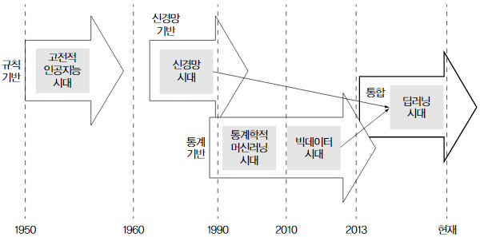

&nbsp;

# Machine Learning

딥러닝은 머신러닝의 일종이고, 머신러닝은 인공지능의 일종이다.

머신러닝은 "데이터를 이용해서 "명시적으로 정의되지 않은 패턴을 컴퓨터로 학습하여 결과를 만들어내는 학문 분야" 이며, 학습 데이터로부터 모델을 찾아내는 귀납적 기법이다.

~~~mermaid
graph LR
	D[학습 데이터] -.-> E(머신러닝)
  E -.-> B
	A[입력 데이터] --> B[모델]
	B --> C[결과]
~~~

### History

#### Artificial Intelligence

소프트웨어가 스스로 판단을 하면 인공지능으로 볼 수 있다.

초기의 인공지능은 알고리즘 같은 것으로 볼 수 있다. 이럴 땐 이렇게 하고 저럴 땐 저렇게 하고와 같은 프로세스를 사람이 직접 코딩하면 소프트웨어가 알아서 적절히 동작을 수행한다. 오류나 예외가 발생하면 그것에 대한 조건을 또 사람이 넣어주게 된다. 

이것이 발전하여 인간보다 월등히 빠른 속도로 가능한 모든 경우의 수를 계산하여 최적의 결과를 도출하는 인공지능이 나왔고, 이것으로 인간 체스 챔피언을 꺾게 된다.

하지만, 자연어 처리, 음성 인식, 영상 인식 등의 분야는 경우의 수가 무한대에 가깝기 때문에 한계에 봉착하게 된다. 사람은 이와 같은 것을 더 잘할 수 있다는 것에 착안하여 사람을 이모델링 하는 방법, 즉 기계 학습이라는 방법이 제시되었다.

#### Machine Learning

기계 학습 인공지능의 한 분야로 훈련 데이터를 이용하여 모델을 만들어 분류, 회귀 등을 한다.

초기에는 사람이 모델을 예측하여 제공하고, 훈련용 데이터를 이용하여 기계가 학습하여 모델을 정교하게 다듬어 나가는 방향으로 발전을 했다.

하지만, 학습에 필요한 양질의 데이터도 부족하고 컴퓨팅 파워도 부족하여 정체가 되었다.

##### Supervised Learning

지도 학습은 학습 시 정답을 사람이 알려주는 방식이다.

##### Unsupervised Learning

비지도 학습은 학습 데이터만 주고 답은 알려주지 않은 채 알아서 학습하도록 하는 방식이다.

##### Reinforcement Learning

O, X 등의 정답이 아니고, 좀 더 나은 보상을 얻게되는 쪽으로 학습을 하도록 하는 방식이다.  게임 등에 적합하며 알파고가 이 방식을 사용했다고 한다.

#### Neural Network

신경망 혹은 인공 신경망은 기계 학습의 한 분야이다. 사람의 뇌의 행동을 모델링 하는 방법이다.

뇌의 뉴런을 모델링한 퍼셉트론을 이용하며, 복잡도에 따라 단층 신경망과 심층 신경망으로 나뉘며, 컴퓨팅 파워가 충분해짐에따라 점차 심층 신경망이 대세가 되었다.

#### Deep Learning

심층 신경망을 이용한 방법 중 하나이다. 알파고를 통하여 알려지게 되었다.

### 분류

머신러닝은 풀고자하는 목표에 따라 지도학습, 비지도학습, 강화학습으로 분류할 수 있으며, 풀어내는 기법에 따라 통계학적, 딥러닝으로 분류할 수 있다.

- **지도학습 (Supervised Learning)**
  값/레이블을 예측하는 시스템을 구축하려는 목적.
  지도학습은 입력(주어진 데이터)과 정답(레이블)을 이용해서 미지의 상태나 값을 예측하는 학습 방법이다.
  예) '예전의 주식 시장 변화를 보고 내일의 주식 시장 변화 예측하기', '문서에 사용된 단어를 보고 해당 문서의 카테고리 분류하기', '사용자가 구매한 상품을 토대로 다음에 구입할 상품 예측하기'

- **비지도학습 (Unsupervised Learning)**
  패턴 추출을 하려는 목적.
  비지도학습은 데이터 자체에서 유용한 패턴을 찾아내는 학습 방법이다.
  예) '군집화(Clustering)', '데이터 이상 검출', '데이터 분포 추측'

- **강화학습 (Reinforcement Learning)**
  상호작용 가능한 시스템을 구축하려는 목적.
  강화학습은 기계(에이전트)가 환경과의 상호작용(선택과 피드백의 반복)을 통해 장기적으로 얻는 이득을 최대화하도록 하는 학습 방법이다.
  예) '바둑', '화성 탐사 로봇이 경로를 탐색하는 과정 (지구에서는 화성의 환경에 대한 데이터를 얻을 수 없으므로, 로봇은 실제 환경에 대한 정보가 거의 없다. 따라서 다음 경로를 판단할 때, [현재 가진 정보를 이용해 다음 행동 정하기(exploitation)], [새로운 정보를 얻기 위해 가보지 않은 곳 탐색(exploration)] 중에서 하나를 선택한다.)'

#### 지도학습

지도학습은 세부적으로 어떤 것을 예측하느냐에 따라 회귀(Regression), 분류(Classification), 랭킹으로 구분한다.

- **회귀**
  값 예측.
  예) '기존 온도 추이를 보고 내일 온도를 예측'

- **분류**
  항목 선택.
  예) '어떤 문서가 도서관의 어떤 분류에 해당하는지 선택'

- **랭킹/추천**
  순서 배열. 
  랭킹학습(learning to rank)은 데이터의 순위를 예측한다.
  추천 시스템은 상품에 대한 사용자 선호도를 예측하는 시스템이다.

  ​

학습 데이터로 얻은 모델에 입력 데이터를 넣어서 결과를 얻는 과정을 추론(Inference)이라고 한다.

머신러닝의 난제는 바로 학습 데이터와 입력 데이터가 차이가 나는 데서 기인한다.

학습 데이터와 입력 데이터가 달라져도 성능 차이가 나지 않게 아는 걸 일반화(Generalization)라고 한다.

머신러닝에서 일반화 성능을 떨어뜨리는 주범 중 하나가 과적합(Overfitting)이다.

과적합은 학습 데이터가 모두 정답이라고 생각하고 모델을 여기에 지나치게 맞추다가 일반화 성능이 떨어지는 모델을 얻는 현상을 말한다.

과적합 문제를 해결하기 위한 대표적인 기법으로 정칙화(Regularization)와 검증(Validation)이 있다.

정칙화는 모델의 형태를 최대한 간단하게 만들려는 수치해석적인 기법이다.

검증은 학습 데이터의 일부를 따로 떼어 내서 학습에는 사용하지 않고 모델의 성능 검증용으로 사용하는 기법을 말한다.

교차 검증(Cross Validation)은 학습 데이터를 학습용 데이터와 검증용 데이터로 나누는 것은 검증과 같은데, 두 데이터를 고정하지 않고 계속 바꿔준다는 점이 다르다.

