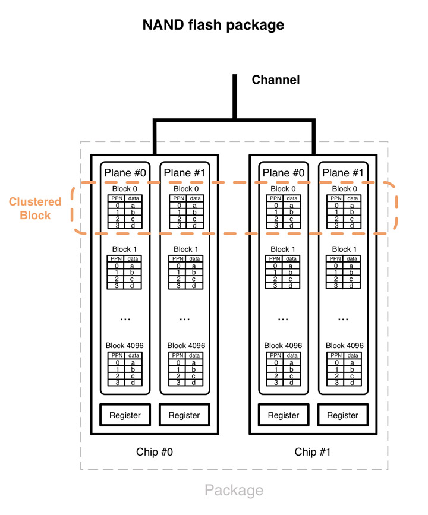

# Structure of SSD (Solid State Drive)

SSD는 flash memory를 기반으로한 저장 매체이다. Bit들은 floating-gate transistor로 구성된 cell에 저장된다. NOR/NAND flash momory의 2가지 종류가 있다.

NAND flash memory module의 중요한 속성은 수명이 제한적 (wearing-off)라는 것이다. 매 P/E cycle마다 일부 전자가 오류로 인하여 transistor에 갇히게 된다. 이런 전자들이 쌓여서 일정 수준을 넘어서면, 그 cell은 사용 불가능한 상태가 된다.

SLC (Single Level Cell), MLC (Multiple Level Cell), TLC (Triple Level Cell)에 따라 수명에 차이가 있다.

> Channel > Package > Chip (Die) > Plane > Block > Page

## NAND Flash Page and Block

Cell은 Block으로 grouping되고, Block은 Plane으로 grouping된다.

SSD Read/Write 시 최소 접근 단위는 Page이고, Erase 시 최소 접근 단위는 Block이다.

# Operation

## Read

한 번에 하나의 page를 통째로 읽어서 사용자가 요청한 data만 골라서 반환한다.

## Write

Read와 마찬가지로 전체 page가 한 번에 write된다. 이렇게 불필요한 write가 발생하는 것을 "Write Amplification"이라고 한다.

NAND flash memory의 page는 반드시 free 상태일 때만 write를 할 수 있다. Data가 변경되면, page의 내용은 내부 register로 복사된 후 register에서 변경되어 새로운 free 상태의 page로 기록된다. 이를 read-modify-update라고 한다.

SSD에서 data는 다른 page로 이동하지 않고 변경될 수 없다. 즉 in-place update가 불가능하다.

변경된 data가 새로운 page에 완전히 기록되면, 원본 page는 stale 상태로 marking되고 erase되지 전까지 그 상태로 남는다.

### Write Amplification

Write amplification과 read-modify-write 현상을 최소화하기 위해서, NAND flash page의 크기보다 작은 data의 쓰기는 가능하면 피해야 한다.

즉, data의 크기는 page 크기에 맞춰서 실행하는 것이 가장 효율적이다. 이를 위해 작은 크기의 data는 buffer에 넣어뒀다가 buffer가 가득차면 write하는 방식을 주로 사용한다.

## Erase

Page는 덮어 쓰기가 불가능하기 때문에 한 번 stale 상태로 된 page는 반드시 erase하는 작업을 거쳐서 free로 전이된다.

단, erase는 해당 page가 포함된 block을 통째로 삭제해야한다.

사용자는 read/write 명령만 사용할 수 있고, erase 명령은 SSD controller가 free 공간이 필요할 때 내부적으로 garbage collection을 통해 실행된다.

## Wear Leveling

NAND flash cell은 너무 빈번하게 P/E cycle이 발생하게 되면 wearing off (사용 불가능) 상태가 되기 때문에 cell간의 작업을 분산하여 각 block들이 동시에 P/E cycle 한계에 도달하도록 하는 것이 FTL의 중요한 목표 중 하나이다.

# FTL (Flash Translation Layer)

SSD는 HDD와 동일한 host interface를 사용한다. LBA array는 덮어쓰기가 가능한 HDD에서만 적합한 요소이며 SSD에는 적합하지 않다. 따라서 NAND flash memory는 내부적인 특성을 숨기고 LBA array를 host로 노출하기 위해 FTL 이라는 부가적인 component를 필요로 한다.

FTL은 Logical Block Mapping과 Garbage collection이라는 2개의 중요한 부분을 담당한다.

## LBM

LBM은 host 영역의 LBA를 NAND flash memory의 PBA로 변환해주는 역할을 담당한다.

Block mapping은 SSD 내부 memory에 저장이 되며, 전원이 꺼져도 문제가 없도록 flash memory에도 저장이 된다. 전원이 켜지면 flash memory에 저장된 mapping table을 읽어서 memory에 loading한다.

Block mapping을 구성하는 가장 단순한 방법은 page 단위로 mapping table을 구성하는 것이지만 memory를 많이 사용하게 된다는 단점이 있다.

Block 단위로 mapping table을 구성하면 필요한 memory는 적어지지만 block단위로 write가 발생하게 되어 write amplification이 증가된다.

이로 인하여 hybrid한 방법들이 나왔다. 이 중 가장 일반적인 방법이 log structured file system과 비슷한 형태의 log-block mapping이다. 이 algorithm은 random write를 sequential write처럼 handling할 수 있도록 해준다.

Write operation은 sequential하게 log block으로 기록되고, log block이 다 채워지면 동일한 LBN을 가지는 block의 data와 병합하여 새로운 free block으로 기록하는 방법이다. Log block은 적은 수만 유지되므로 page 단위의 mapping은 아주 소량만 관리되면 된다.

Log block FTL은 더 나은 최적화를 할 수 있도록 해주는데, 그 중에서도 중요한 것은 switch-merge (혹은 swap-merge) 이다. Logical block의 주소가 한 번에 기록된다고 가정해보면, 이는 그 logical 주소의 새로운 data들이 동일한 log block에 기록된다는 것을 의미한다. 이 log block은 전체 logical block의 data를 모두 가지기 때문에 이 log block을 별도로 병합하여 새로운 block으로 옮기는 과정은 불필요한 작업이 된다. 이런 경우에는 단순히 log block mapping을 거치지 않고 data block mapping을 바로 변경할 수 있으면 더 빠를 것이다. 이렇게 data block mapping table에서 data block과 log block을 바꾸는 것을 switch-merge라고 한다.

## Garbage Collection

GC는 stale 상태의 page들이 erase되어 새로운 data를 write할 수 있도록 free 상태로 만들어주는 과정이다.

Erase는 write보다 느리므로 background로 작업을 하여 성능을 높인 SSD controller도 있다. Background GC는 Idle Collection으로도 불린다. SSD controller가 한가한 시간에 주기적으로 stale 상태의 page를 free 상태로 만들어 준다.

Parallel GC를 채택한 SSD controller도 있다. Host의 write 요청과 동시에 GC를 실행하는 방식이다. Host로부터 write 요청이 올 때 동시에 GC가 필요할 정도로 과도한 workload가 걸리는 상황은 흔하지 않다. 이런 경우에는 background로 실행되는 GC가 foreground로 실행되는 host 명령의 실행을 방해할 수 있다. TRIM 명령과 Overprovisioning은 이런 현상을 줄여줄 수 있다.

Block이 이동되어야 하는 조금 덜 중요한 이유 중 하나는 read disturb이다. Read는 주위 cell들의 상태를 변경할 수도 있으므로 일정 회수 이상의 read가 수행된 block은 다른 위치로 옮겨져야 한다.

뜸하게 변경되는 data를 cold 혹은 static data라고 하고, 빈번하게 변경되는 data를 hot 혹은 dynamic data라고 한다.

Page에 hot/cold data가 섞여 있다면 wear-leveling을 위해서 hot data가 GC될 때마다 cold data도 같이 옮겨 다녀야 한다. 이런 경우 write amplificaion이 더 심해질 것이다.

따라서, SSD의 성능을 향상시키기 위한 방법으로 hot/cold data를 최대한 다른 page로 분리시켜야 하며, 이는 GC가 좀 더 효율적으로 동작하게 한다.

Data가 불필요하거나 삭제해야할 경우 최대한 모아서 단일 operation으로 삭제하는 것이 좋다. GC 처리가 한 번에 큰 영역을 처리하도록 해주며, 그와 동시에 내부 fragmentation을 최소화 시켜줄 것이다.

### Hot Data Buffering

매우 빈번하게 변경되는 hot data는 최대한 buffering 되었다가 SSD에 덜 자주 update되도록 하는 것이 좋다.

# 고급 기능

## TRIM

TRIM 명령은 OS에서 해당 logical 공간이 더 이상 필요하지 않다는 message를 SSD controller에게 전달해주는 것이다. 이렇게 SSD controller가 불필요한 block들에 대한 정보를 가지고 있다면, GC process는 더 이상 불필요한 page들을 복사해서 이동하지 않아도 되며 언제든지 필요할 때 erase할 수 있게 된다. TRIM 명령은 SSD controller, OS, FS 3가지 component가 모두 TRIM을 지원할 때만 사용 가능하다.

## Over-Provisioning

Over-Provisioning은 단순히 logical block보다 physical block의 수가 더 많도록 해주는 것인데, 일정 비율의 physical block을 SSD controller는 볼 수 있지만 OS나 FS는 보지 못하도록 예약해두는 것이다.

SSD 제조사는 이미 7~25% 정도의 Over-Provisioning 공간을 보유하고 있으며, 사용자는 단순히 사용 가능한 physical 공간의 크기보다 작은 크기로 partitioning함으로써 더 많은 Over-Provisioning 공간을 생성할 수 있다.

Over-Provisioning은 NAND flash cell의 제한된 수명을 극복하기 위한 wear-leveling mechanism에도 도움이 된다.

Over-Provisioning 공간은 NAND flash block의 buffer처럼 작동하기 때문에, write saturation되는 시점에도 GC가 과도한 write를 견딜 수 있도록 해준다.

## Secure Erase

일부 SSD controller는 ATA Secure Erase 기능을 제공하는데, 이는 사용자가 기록했던 모든 data를 삭제하고 FTL mapping table을 초기화함으로써 SSD drive를 초기 상태로 만들어서 성능을 회복시키는 것이 주요 목적이다.

## Native Command Queueing (NCQ)

NCQ는 SSD drive가 내부적인 병렬 기능 처리 능력을 이용해서 동시에 여러 host 명령을 처리할 수 있도록 해주는 SATA의 기능이다. SSD drive의 낮은 latency에 더불어 최신의 SSD drive는 host로부터의 latency를 극복하기 위해서 NCQ를 사용한다.

빠른 응답속도를 위해서 NCQ를 사용하는데, NCQ는 host의 명령을 queueing하여 우선순위를 재설정하고 때로는 지연처리를 하기도 한다.

## PLP (Power-Loss Protection)

Power failure에 대한 대비책이다. Super capacitor를 내장하는 방식 등으로 대비가 가능하다.

# SSD Internal Parallelism

SSD architecture에서 여러 level의 내부적인 병렬 처리 능력을 묶어서, 여러 chip에 걸쳐서 동시에 2개 이상의 block을 access할 수 있다. 이렇게 동시 접근 가능한 block들을 묶어서 clustered block이라고 한다.

## Channel-Level Parallelism

Flash controller는 여러 channel을 통해서 flash package와 통신한다. 이 channel들은 서로 독립적이며 동시에 access 가능하다. 각 개별 channel은 여러 package에 의해서 공유된다.

## Package-Level Parallelism

Channel의 package들은 독립적으로 접근이 가능하다. 동일 channel을 공유하는 package들은 interleaving mode로 동시에 명령 실행에 사용될 수 있다.

## Chip-Level Parallelism

Package는 하나 또는 두 개의 chip(or die)을 가지며, 각 chip들은 독립적으로 병렬 접근이 가능하다.

## Plane-Level Parallelism

각 chip은 2개 이상의 plane을 가지는데, 동일 operation은 하나의 chip내의 여러 plane에 대해서 동시 실행이 될 수 있다. Plane은 block들을 가지며, 각 block들은 다시 page들을 가진다. 또한, plane은 plane 단위의 operation에 사용되는 register를 가진다.

## Clustered Blocks

여러 chip에 걸쳐서 한 번에 access될 수 있는 여러 개의 block을 clustered block이라고 하는데, RAID system에서 사용되는 striping과 비슷한 idea이다.

한 번에 접근 가능한 logical block 주소들은 개별 flash package에서 서로 다른 SSD chip들에 걸쳐서 striping된다. Striping block들은 여러 channel을 동시에 사용할 수 있으며, 그 channel들의 대역폭을 묶어서 생각할 수 있다. 또한, read/write/erase operation을 병렬로 처리할 수 있다. 이는 clustered block size 또는 그 배수 크기의 I/O operation은 SSD의 다양한 내부 병렬 처리 능력을 최대한 활용할 수 있다는 것을 보장한다.

# Access Pattern

## Write

Write가 clustered block의 크기보다 작다면 random write는 sequential write보다 느리지만, clustered block과 동일하거나 배수 크기의 data를 write한다면 random write도 SSD의 모든 병렬 처리 능력을 활용하게 되므로 sequential write와 비슷한 throughput을 낼 수 있다.

하나의 큰 write 명령은 병렬로 실행되는 많은 작은 write 명령만큼의 throughput을 낼 수 있다. 하지만 latency 측면에서 보면, 하나의 큰 write 명령은 여러 개의 작은 write 명령보다 더 나은 응답 속도를 보장받을 수 있다.

여러 개의 동시 thread로 작은 write 명령은 하나의 작은 write 명령보다 나은 throughput을 제공한다. 만약 I/O data가 작고 buffering 또는 batch로 묶을 수 없다면 multi-thread로 write를 수행하는 것이 좋다.

## Read

Read는 write보다 빠르다. Sequential read와 random read 성능은 workload에 의존적이다. FTL은 logical block과 physical block을 동적으로 mapping하며, write를 여러 channel로 striping 해준다. 이 방법을 write-order-based mapping이라고 한다.

Read 성능은 write pattern의 결과이다. 대량의 data가 한 번에 write되면, 그 data는 NAND flash chip에 골고루 분산되어 저장될 것이다. 그래서 연관 data들은 최대한 동일 page와 block 그리고 clustering block에 기록되도록 하는 것이 좋다. 그래야만 SSD의 병렬 처리 능력을 이용해서 나중에 한 번의 I/O로 빠르게 읽을 수 있다.

동시 random read는 SSD의 read ahead mechanism을 제대로 활용하지 못할 수도 있다. 또한 다중으로 logical block 주소를 access하는 것은 내부적인 병렬 처리 기능을 활용하지 못하고 결국 동일 chip으로 집중되어 버릴 수도 있다. 게다가 큰 data의 read operation은 연속된 주소를 access함으로써 read ahead buffer를 활용할 수 있다. 결과적으로 한 번에 대량의 data를 read하는 방법이 추천된다.

## 동시 Read/Write

작은 data를 read/write하는 작업이 동시에 발생하게 되면 성능 저하를 유발할 수 있다. 동일한 내부 자원을 위해 read/write가 경합할 수 있고, read ahead와 같은 내부 최적화 mechanism을 활용하지 못하게 만들기도 하기 때문이다.

# System Optimization

## Partition Alignment

Write는 page의 크기에 맞춰 실행된다. Page의 크기에 맞춰서 write하도록 요청된 data는 NAND flash의 physical page에 바로 read-modify-write과정 없이 write될 수 있다.

Write하는 data가 page 크기라 하더라도, physical page에 alignment되지 않은 write는 2개의 NAND flash physical page에 기록되어야 한다. 이런 현상이 발생하면 SSD drive는 2번의 read-modify-write operation을 수행해야 한다.

SSD flash memory와 logical write가 정확하게 맞춰지도록 하기 위해서는 반드시 partition이 NAND flash memory의 page와 alignment되도록 format해야 한다.

## File System Parameter

성능을 위해 TRIM 명령을 지원하는 FS으로 설정해야한다. TRIM 명령은 host에서 block이 삭제되는 경우에 그 삭제 block 정보를 SSD drive로 전달해주는 역할을 하며, 이렇게 삭제 block 정보를 SSD controller가 알게 되면 GC에서는 삭제된 block에 대해서 불필요한 복사 작업을 피할 수 있게 된다.

## Swap

Swap이 자주 사용되는 경우에는 많은 I/O 요청이 발생하기 때문에, SSD drive에 swap partition이 있는 경우 SSD의 random write가 자주 발생하며 그로 인하여 수명이 훨씬 더 빨리 줄어들 수 있다.

# References

* [Coding for SSD - Part1](https://tech.kakao.com/2016/07/13/coding-for-ssd-part-1/)
* [Coding for SSD - Part2](https://tech.kakao.com/2016/07/14/coding-for-ssd-part-2/)
* [Coding for SSD - Part3](https://tech.kakao.com/2016/07/15/coding-for-ssd-part-3/)
* [Coding for SSD - Part4](https://tech.kakao.com/2016/07/16/coding-for-ssd-part-4/)
* [Coding for SSD - Part5](https://tech.kakao.com/2016/07/17/coding-for-ssd-part-5/)
* [Coding for SSD - Part6](https://tech.kakao.com/2016/07/18/coding-for-ssd-part-6/)
